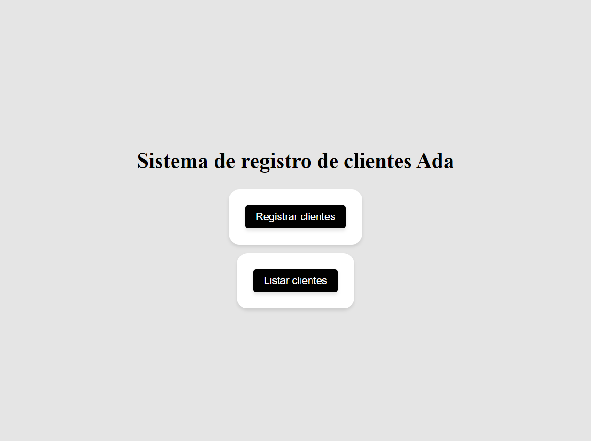
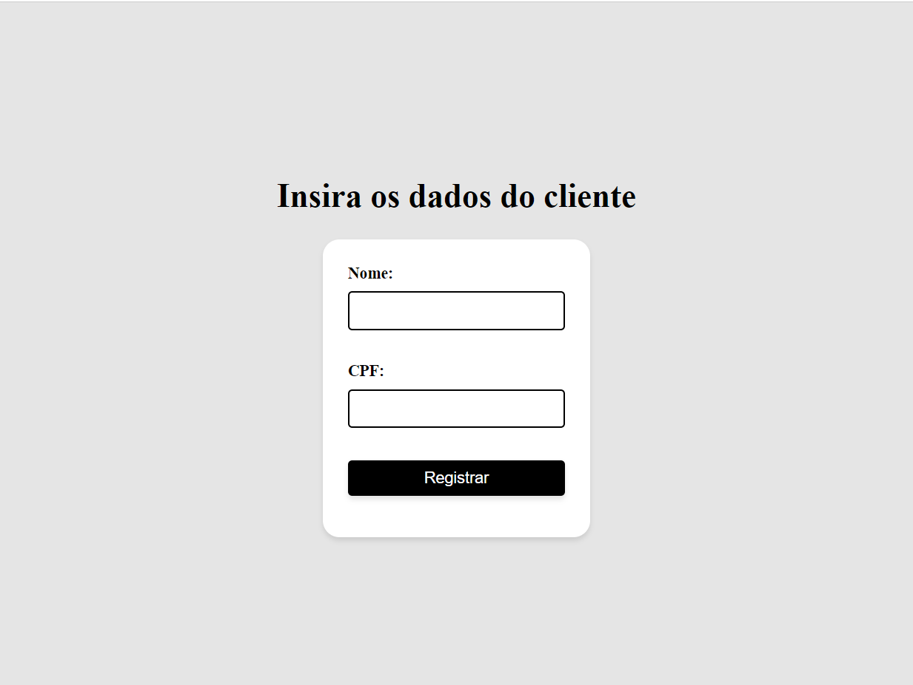
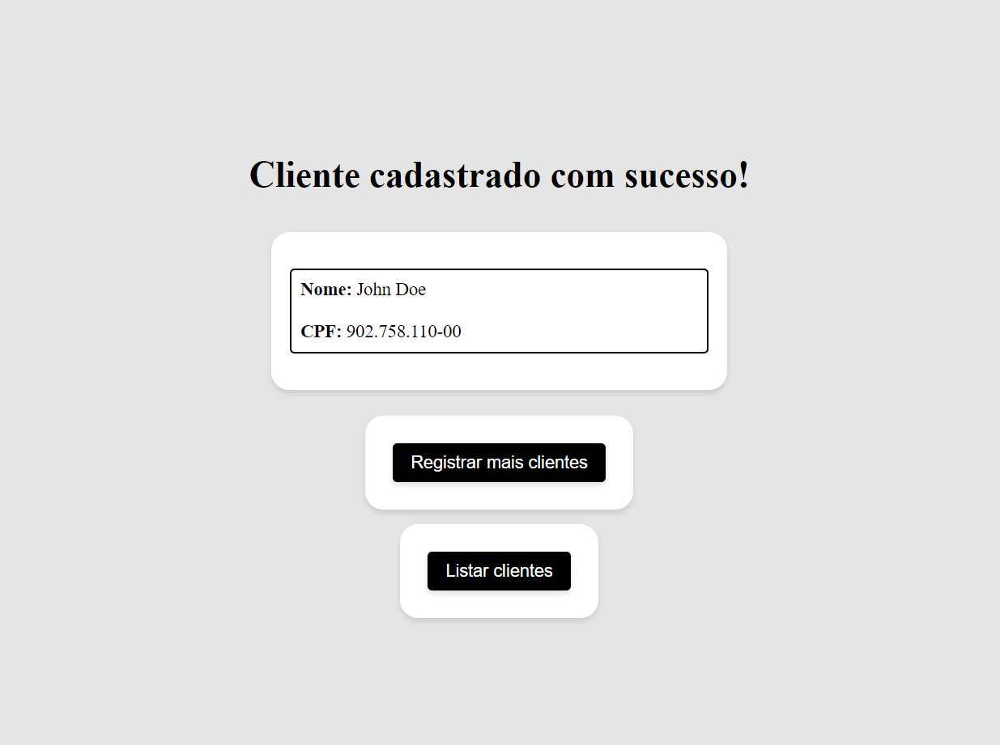

[English](README.md) | [Português](README.pt-br.md)

## Customer Registration Exercise

This project is a customer registration application developed using Jakarta EE. The application was created as part of the fourth module of the Back-end track of the [Futuro Polo Tech](https://polotech.americanas.io/) program. This program is a partnership between the technology school [Ada](https://ada.tech/sou-aluno) and [Americanas](https://carreiras.americanas.com/).

### Main Menu

When accessing the local server, the user is redirected to the main page, where it is possible to choose between registering a new customer or viewing all customers already registered, as shown below:

  

### Customer Registration Menu

When selecting the option to register a new customer, the user is redirected to the registration page, where it is possible to fill in the data of the new customer, as shown below:

  

### Registration Confirmation

After filling in the data of the new customer, the user is redirected to the confirmation page, where it is possible to view the data of the new customer, as shown below:

  

### Customer Listing Menu

When selecting the option to view all customers, the user is redirected to the listing page, where it is possible to view all customers already registered.

  

Customers are stored in memory using a list of objects of type `Client` inside the `InMemoryDatabase` class.

To create a JSP page that had the registered users, when requested by the ListClientsServerlet, the UserService builds the HTML code with the necessary tags for styling based on the list of clients present in the `InMemoryDatabase`.

## Running the Code

To run this project, clone the repository and import it into your preferred Java development environment.
Make sure you have Java Development Kit (JDK) version 17 or higher installed on your machine.

You will also need to set up an application server, such as Apache Tomcat, to run the project.
