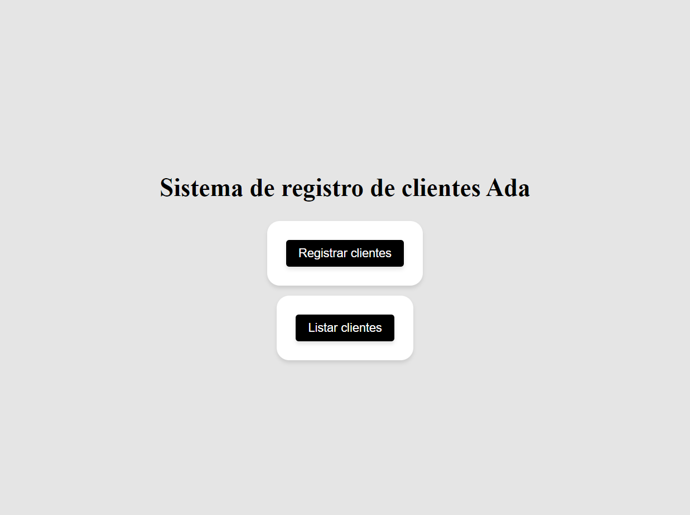
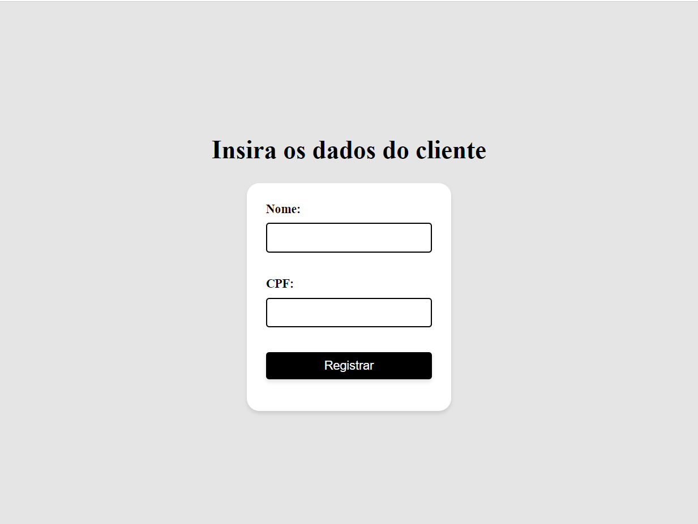
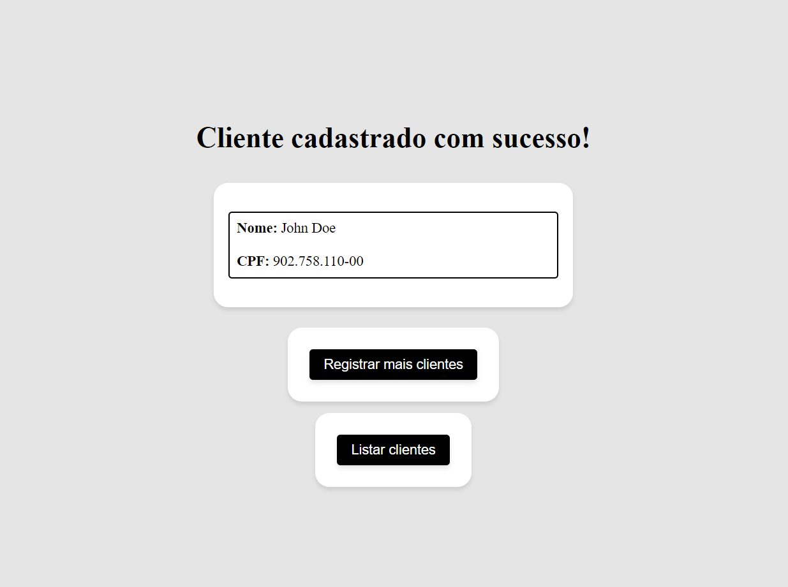
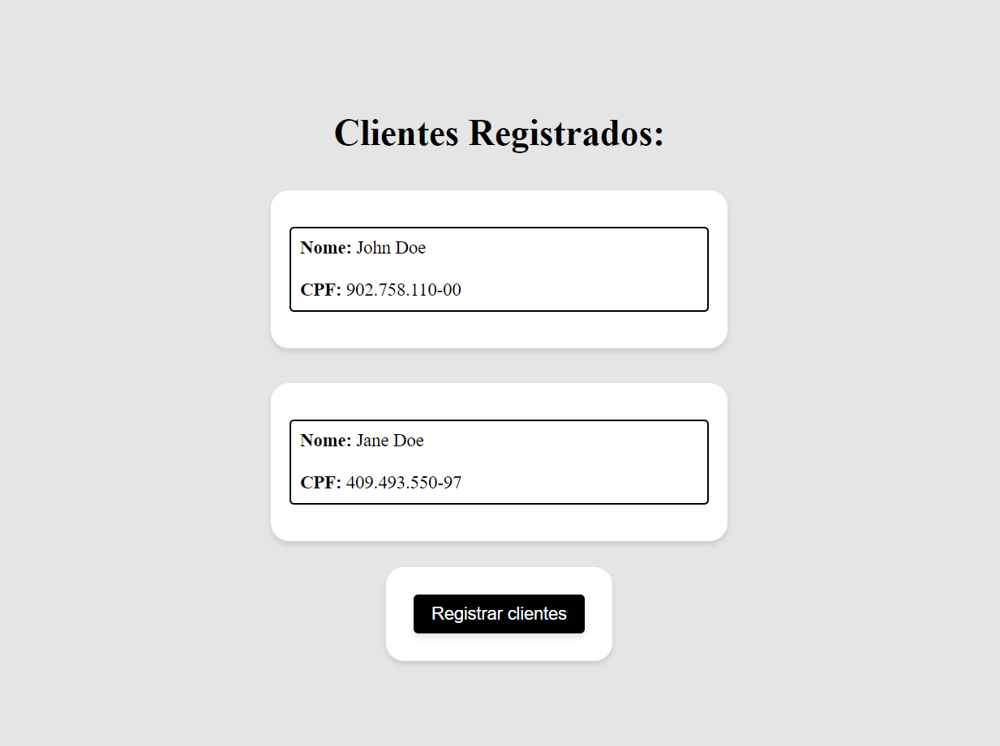

[English](README.md) | [Português](README.pt-br.md)

## Exercício de Cadastro de Clientes

Este projeto é uma aplicação de cadastro de clientes desenvolvida usando Jakarta EE. A aplicação foi criada como parte do quarto módulo da trilha de
Back-end do programa [Futuro Polo Tech](https://polotech.americanas.io/). Este programa é uma parceria entre a escola de tecnologia
[Ada](https://ada.tech/sou-aluno) e a [Americanas](https://carreiras.americanas.com/).

### Menu Principal

Ao acessar o servidor local, o usuário é redirecionado para a página principal, onde é possível escolher entre registrar um novo cliente ou visualizar todos os clientes já cadastrados. como mostrado abaixo:

  

### Menu de Cadastro de Clientes

Ao selecionar a opção de registrar um novo cliente, o usuário é redirecionado para a página de cadastro, onde é possível preencher os dados do novo cliente. Como mostrado abaixo:

  

### Confirmação de Cadastro

Após preencher os dados do novo cliente, o usuário é redirecionado para a página de confirmação, onde é possível visualizar os dados do novo cliente. Como mostrado abaixo:

  

### Menu de Listagem de Clientes

Ao selecionar a opção de visualizar todos os clientes, o usuário é redirecionado para a página de listagem, onde é possível visualizar todos os clientes já cadastrados.

  

Os clientes são armazenados em memória, usando uma lista de objetos do tipo `Client` dentro da classe `InMemoryDatabase`. 

Para conseguir criar uma página JSP que tivesse os usuários cadastrados, quando requisitado pelo ListClientsServerlet, o UserService contrói o cógido HTML com as tags necessárias para estilização baseando-se na lista de clientes presente na `InMemoryDatabase`.

## Executando o código

Para executar este projeto, clone o repositório e importe-o no seu ambiente de desenvolvimento Java preferido.
Certifique-se de ter o Java Development Kit (JDK) versão 17 ou superior instalado na sua máquina.

Será necessário também configurar um servidor de aplicação Java, como o Apache Tomcat, para executar o projeto.

